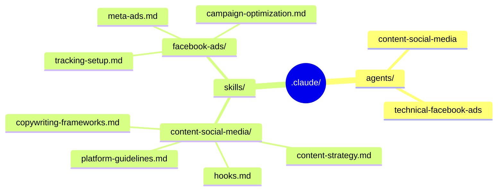
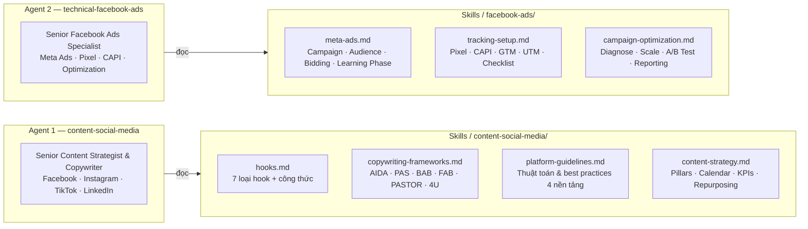
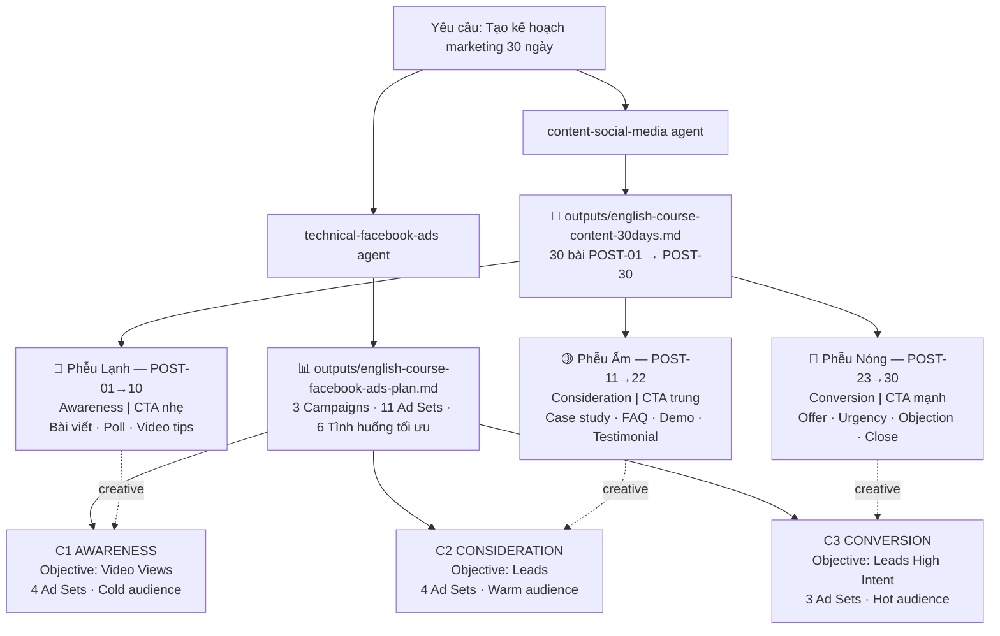

# 2 Sub-Agents & Skills — Claude Code

> Không gian làm việc gồm 2 sub-agents chuyên biệt, mỗi agent được trang bị bộ SKILLS riêng để tự động hoá công việc marketing.

---

## Tổng quan kiến trúc



---

## Agents & Skills



---

## Kết quả thực chiến

> **Case study:** Khóa học tiếng Anh giao tiếp cho người đi làm (fanpage Facebook)



### Ngân sách đề xuất

| Mức | Tổng 30 ngày | CPL mục tiêu | Leads dự kiến |
|-----|-------------|--------------|--------------|
| Nhỏ | 15 triệu VND | 50K – 150K | 100 – 300 |
| Trung | 45 triệu VND | 80K – 200K | 225 – 562 |
| Lớn | 90 triệu VND | 100K – 250K | 360 – 900 |

---

## Cài đặt vào Claude Code

```bash
cp -r .claude/agents/* ~/.claude/agents/
cp -r .claude/skills/* ~/.claude/skills/
```

